# EduFlow — балаларды курсқа дайындау жүйесі
## Жобалау құжаттамасы: IDEF0-ден Deployment диаграммасына дейін

Бұл папкада EduFlow жобасының толық моделі бар: 18 диаграмма, әрқайсысы екі форматта.

| Папка / файл | Не бар |
|---|---|
| `drawio/` | Әр диаграмманың өңделетін нұсқасы (`.drawio`) |
| `png/` | Әр диаграмманың суреті (есепке / слайдқа қоюға дайын) |
| `EduFlow_all_diagrams.drawio` | Барлық 18 диаграмма бір файлда, әрқайсысы жеке бетте (төменгі қойындылар) |

**Қалай ашу керек:** <https://app.diagrams.net> → *File → Open from → Device* → `.drawio` файлын таңдайсың.
Немесе draw.io Desktop бағдарламасы, не VS Code-тағы «Draw.io Integration» кеңейтімі.
Мәтінді, түсті, орынды өзгертіп, *File → Export as → PNG* арқылы жаңа сурет алуға болады.
Скриншот жасамаған дұрыс, себебі суретте таңдау белгілері (көк ×, бағыттауыштар) қалып қояды.

> **Автор** жолы IDEF0 бланкілерінде бос тұр (`АВТОР: ____________`). draw.io-да ашып, өз аты-жөніңді жаз.

---

## 0. Сенің Use Case диаграммаңа ескертпелер

Диаграммаң жақсы құрылған. include/extend бағыттары дұрыс, ескертпе (note) бар, жүйе шекарасы көрсетілген.
Мұғалім байқауы мүмкін кемшіліктерді түзетіп, жаңа нұсқасын `10_UseCase` файлына салдым:

1. **Актерлердің аты жоқ еді.** Бұл ең маңызды қате, өйткені актер атаусыз болмайды. Енді аттары бар:
   Қонақ, Оқушы, Ата-ана, Мұғалім, Методист, Әкімші, Тіркелген пайдаланушы (абстрактілі),
   «жүйе» AI сервисі, «жүйе» Төлем жүйесі.
2. **«Тіркелген пайдаланушы» → «Жүйеге кіру» байланысы үзік сызықпен, бағыттауышпен** сызылған еді.
   Актер мен прецедент арасындағы байланыс (association) **тұтас сызықпен** сызылады.
   Үзік сызық тек «include» / «extend» / тәуелділік үшін қолданылады.
3. **Ата-ана жүйеге кіре алмайтын болып тұрған.** Енді оқушы, ата-ана, мұғалім, методист және әкімші
   «Тіркелген пайдаланушы» актерінен мұраланады, сондықтан бәрі «Жүйеге кіру» прецедентін пайдаланады.
4. **«Оқушы → Қонақ» мұрагерлігі алынды.** Тіркелген оқушы қайтадан «Тіркелу» прецедентін орындамайды.
   Қонақ — жеке, тіркелмеген актер.
5. **Сыртқы жүйелер** (AI сервисі, Төлем жүйесі) «жүйе» стереотипімен белгіленді. Олар — қосалқы актерлер.
6. «Жаңа курс құру» енді «Курс бағдарламасын басқару» прецедентіне **«extend»** арқылы байланысқан.
   Сендегі генерализация нұсқасы да қате емес, қайсысын қалдыратыныңды өзің шеш.

---

## 1. IDEF0 — функционалдық модель

IDEF0 жүйе **не істейтінін** көрсетеді. Әр функцияның (блоктың) 4 жағы бар:

| Жағы | Атауы | Мағынасы | EduFlow мысалы |
|---|---|---|---|
| Сол жақ | **I** — Input (кіріс) | Не өңделеді | Ата-ана мен бала туралы деректер |
| Жоғарғы | **C** — Control (басқару) | Немен реттеледі (ереже, стандарт) | Курс бағдарламалары, бағалау критерийлері |
| Оң жақ | **O** — Output (шығыс) | Нәтиже | Курсқа дайындалған оқушы, есептер |
| Төменгі | **M** — Mechanism (механизм) | Кім / не орындайды | Мұғалім, EduFlow платформасы |

### 1.1. A-0 контекстік диаграмма — `01_IDEF0_A-0`
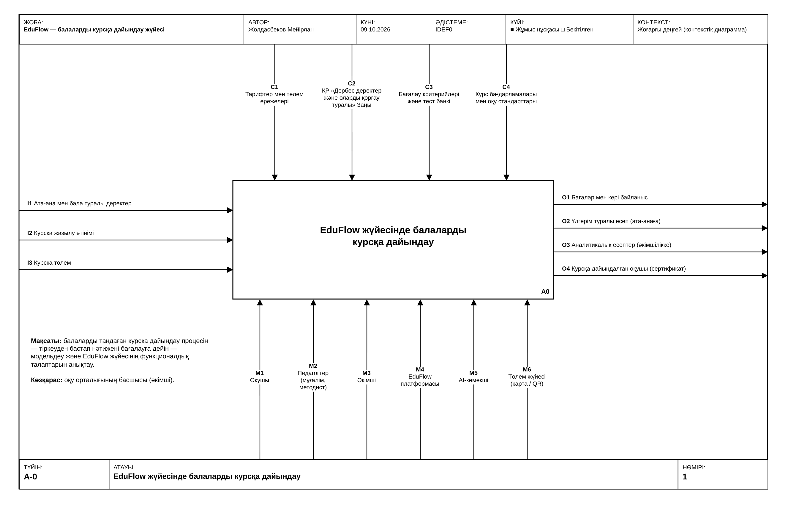

* **Функция:** «EduFlow жүйесінде балаларды курсқа дайындау».
* **Мақсаты:** тіркеуден нәтижені бағалауға дейінгі процесті модельдеу және жүйенің функционалдық талаптарын анықтау.
* **Көзқарас (viewpoint):** оқу орталығының басшысы (әкімші).

| Код | Атауы |
|---|---|
| I1 / I2 / I3 | Ата-ана мен бала туралы деректер / Курсқа жазылу өтінімі / Курсқа төлем |
| C1 / C2 / C3 / C4 | Тарифтер мен төлем ережелері / ҚР «Дербес деректер және оларды қорғау туралы» Заңы / Бағалау критерийлері және тест банкі / Курс бағдарламалары мен оқу стандарттары |
| O1 / O2 / O3 / O4 | Бағалар мен кері байланыс / Үлгерім есебі (ата-анаға) / Аналитикалық есептер / Курсқа дайындалған оқушы (сертификат) |
| M1 … M6 | Оқушы, Педагогтер (мұғалім, методист), Әкімші, EduFlow платформасы, AI-көмекші, Төлем жүйесі |

### 1.2. A0 декомпозиция — `02_IDEF0_A0`
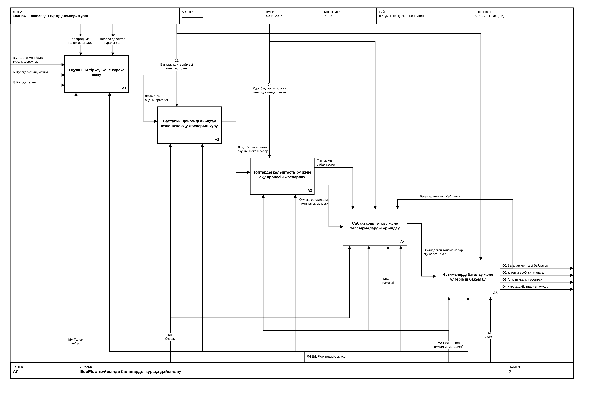

A0 функциясы 5 ішкі функцияға бөлінді. Олар «баспалдақ» түрінде орналасқан (IDEF0 талабы бойынша 3–6 блок):

| Блок | Функция | Негізгі нәтижесі |
|---|---|---|
| **A1** | Оқушыны тіркеу және курсқа жазу | Жазылған оқушы профилі |
| **A2** | Бастапқы деңгейді анықтау және жеке оқу жоспарын құру | Деңгейі анықталған оқушы, жеке жоспар |
| **A3** | Топтарды қалыптастыру және оқу процесін жоспарлау | Топтар, сабақ кестесі, материалдар |
| **A4** | Сабақтарды өткізу және тапсырмаларды орындау | Орындалған тапсырмалар, оқу белсенділігі |
| **A5** | Нәтижелерді бағалау және үлгерімді бақылау | Бағалар, есептер, курсқа дайын оқушы |

**Кері байланыс:** A5 шығысы «Бағалар мен кері байланыс» A4-ке **басқару** ретінде қайтады.
Яғни мұғалімнің бағасы оқушының келесі жұмысын реттейді.
A-0-дегі барлық I/C/O/M жебелері A0-де де бар. Бұл IDEF0-дегі **баланс ережесі**.

### 1.3. Екінші деңгей декомпозициялар
| Файл | Түйін | Ішкі функциялар |
|---|---|---|
| `03_IDEF0_A1` | A1 | A11 Ата-ана мен баланы тіркеу → A12 Курсты таңдау және өтінімді рәсімдеу → A13 Курсқа ақы төлеу → A14 Жазылуды растау. *Төлем қатесі* A12-ге кері байланыспен қайтады. |
| `04_IDEF0_A2` | A2 | A21 Тест нұсқасын құрастыру → A22 Тест тапсыру → A23 Нәтижені автоматты бағалау → A24 Жеке оқу жоспарын құру. Ескертпе: балл төмен болса, «Дайындық модулі» қосылады. |
| `05_IDEF0_A4` | A4 | A41 Материалдарды жариялау → A42 Видеосабақ → A43 Үй тапсырмасын орындау ⇄ A44 AI-көмекшіден түсіндірме алу (кері байланыс). |
| `06_IDEF0_A5` | A5 | A51 Автоматты тексеру → A52 Мұғалімнің тексеруі → A53 Үлгерімді есептеу, ата-анаға есеп → A54 Аналитика. «( ) Есептілік нысандары» — **туннельді жебе**, ол ата-аналық диаграммада көрсетілмейді. |

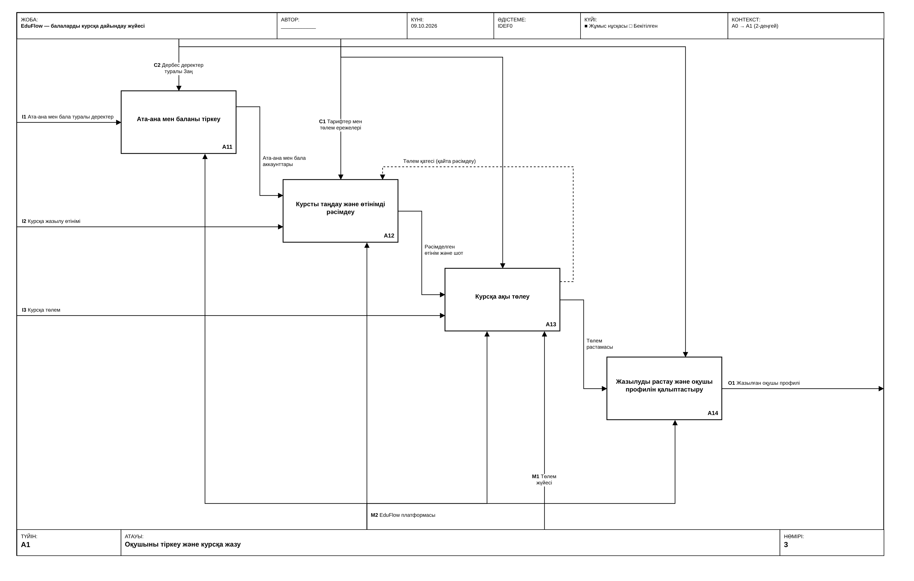
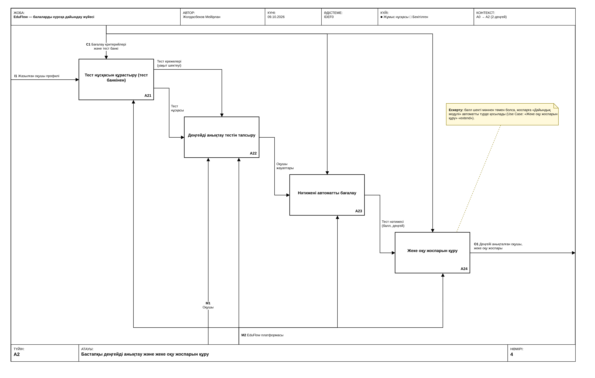
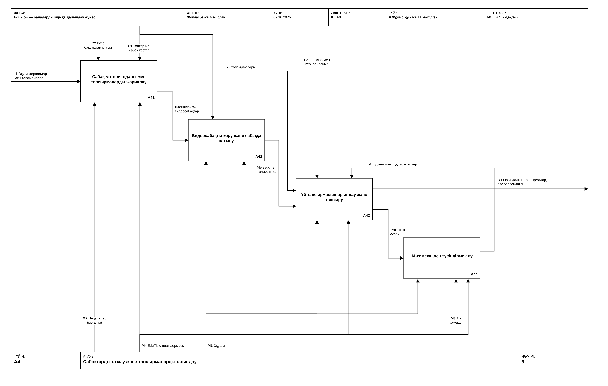
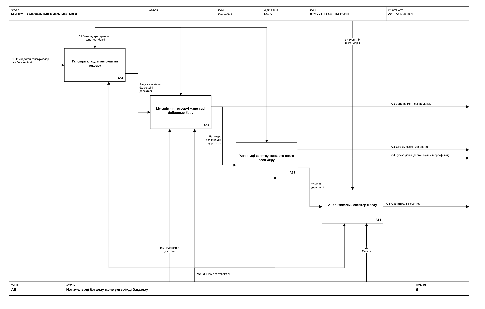

---

## 2. IDEF3 — процесс ағыны — `07_IDEF3`
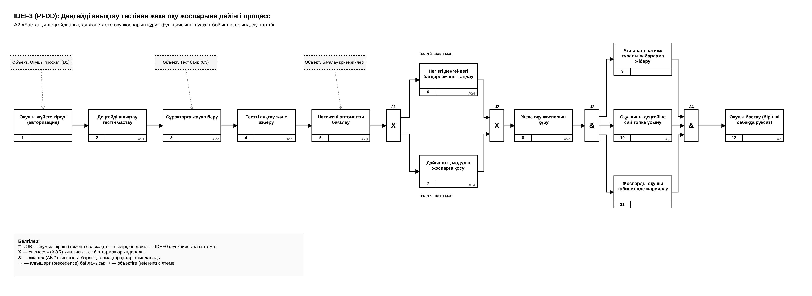

IDEF0 «не» істелетінін көрсетсе, IDEF3 **қандай ретпен** істелетінін көрсетеді.
Мұнда A2 функциясы (деңгей тесті → жеке жоспар) уақыт бойынша сипатталған.

* **UOB** (жұмыс бірлігі) — тіктөртбұрыш. Төменгі сол жақта нөмірі, оң жақта IDEF0 функциясына сілтеме тұр (мысалы A23).
* **J1 / J2 (X — XOR):** балл шекті мәннен жоғары болса, негізгі бағдарлама таңдалады. Төмен болса, дайындық модулі қосылады. Екі тармақтың тек біреуі орындалады.
* **J3 / J4 (& — AND):** ата-анаға хабарлама жіберу, топқа ұсыну және жоспарды жариялау **қатар** орындалады. Үшеуі де аяқталғанда ғана оқу басталады.
* Үзік сызықты жебелер — **объектілерге (referent) сілтемелер**: Оқушы профилі, Тест банкі, Бағалау критерийлері.

---

## 3. DFD — деректер ағыны диаграммалары (Gane–Sarson нотациясы)

### 3.1. Контекстік диаграмма — `08_DFD_context`
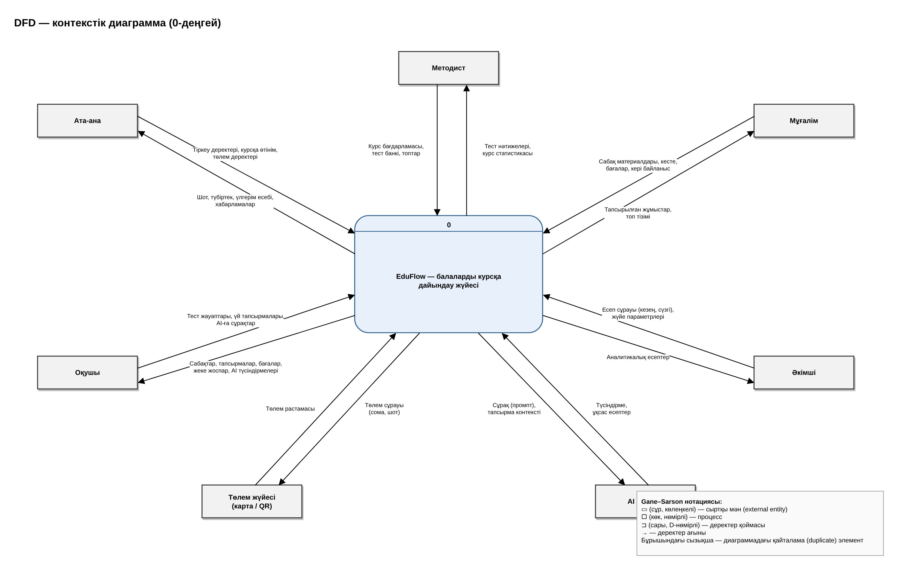

Бүкіл жүйе бір процесс ретінде көрсетілген («0»). Айналасында 7 сыртқы мән бар:
Ата-ана, Оқушы, Мұғалім, Методист, Әкімші, Төлем жүйесі, AI сервисі.

### 3.2. 1-деңгей — `09_DFD_level1`
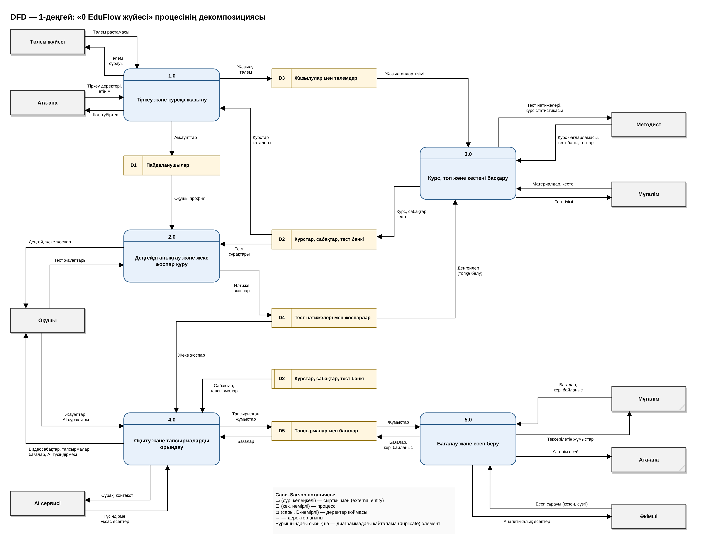

* **Процестер:** 1.0 Тіркеу және курсқа жазылу · 2.0 Деңгейді анықтау және жоспар құру · 3.0 Курс, топ және кестені басқару · 4.0 Оқыту және тапсырмаларды орындау · 5.0 Бағалау және есеп беру.
* **Деректер қоймалары:** D1 Пайдаланушылар · D2 Курстар, сабақтар, тест банкі · D3 Жазылулар мен төлемдер · D4 Тест нәтижелері мен жоспарлар · D5 Тапсырмалар мен бағалар.
* **Баланс:** контекстік диаграммадағы әр ағын 1-деңгейде де бар. Диаграмма оқылуы оңай болуы үшін D2, Мұғалім мен Ата-ана екінші рет көрсетілген. Бұларды қайталама элементтер (duplicate) деп атайды, олардың бұрышында сызықша тұр.

---

## 4. Use Case — `10_UseCase`
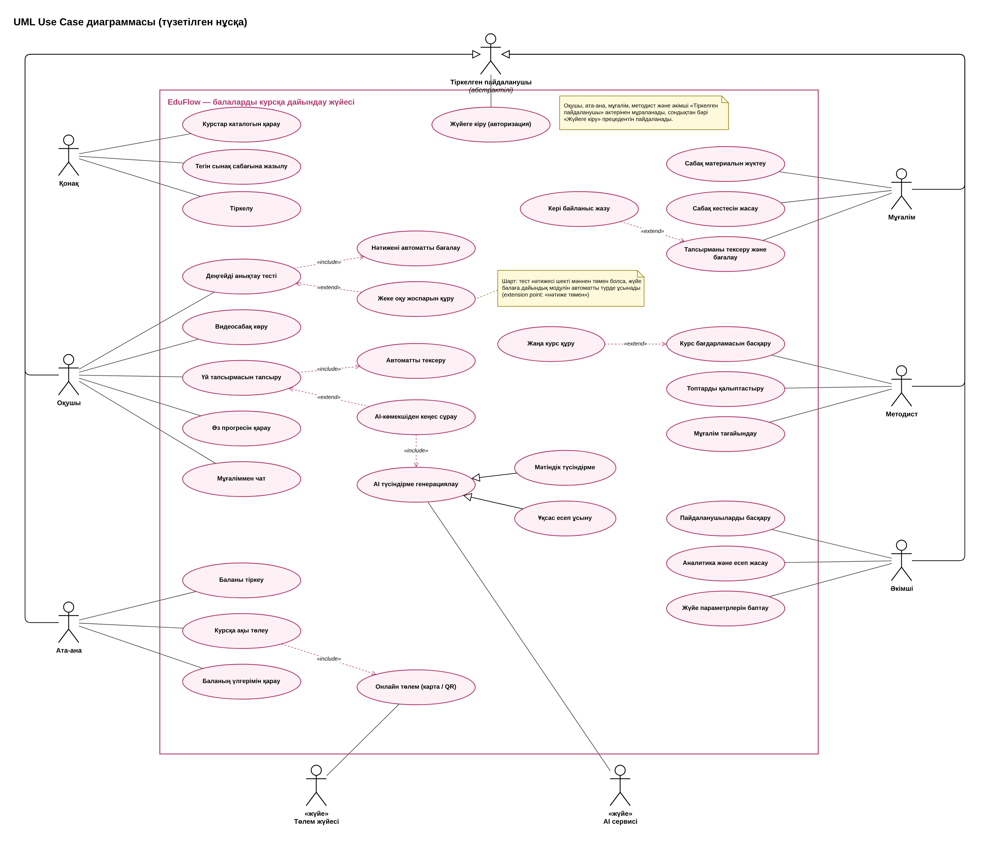

| Актер | Негізгі прецеденттері |
|---|---|
| Қонақ | Курстар каталогын қарау, Тегін сынақ сабағына жазылу, Тіркелу |
| Оқушы | Деңгейді анықтау тесті, Видеосабақ көру, Үй тапсырмасын тапсыру, Өз прогресін қарау, Мұғаліммен чат |
| Ата-ана | Баланы тіркеу, Курсқа ақы төлеу, Баланың үлгерімін қарау |
| Мұғалім | Сабақ материалын жүктеу, Сабақ кестесін жасау, Тапсырманы тексеру және бағалау |
| Методист | Курс бағдарламасын басқару, Топтарды қалыптастыру, Мұғалім тағайындау |
| Әкімші | Пайдаланушыларды басқару, Аналитика және есеп жасау, Жүйе параметрлерін баптау |
| AI сервисі, Төлем жүйесі | Қосалқы актерлер: AI түсіндірме генерациялау, Онлайн төлем |

* **«include»** — міндетті түрде қосылатын бөлік. Мысалы, *Үй тапсырмасын тапсыру* әрдайым *Автоматты тексеру*-ді қамтиды.
* **«extend»** — шартқа байланысты қосылатын бөлік. Мысалы, *AI-көмекшіден кеңес сұрау* *Үй тапсырмасын тапсыру*-ды кеңейтеді, бірақ оқушы сұрамаса орындалмайды.

---

## 5. ER диаграмма — `11_ER`
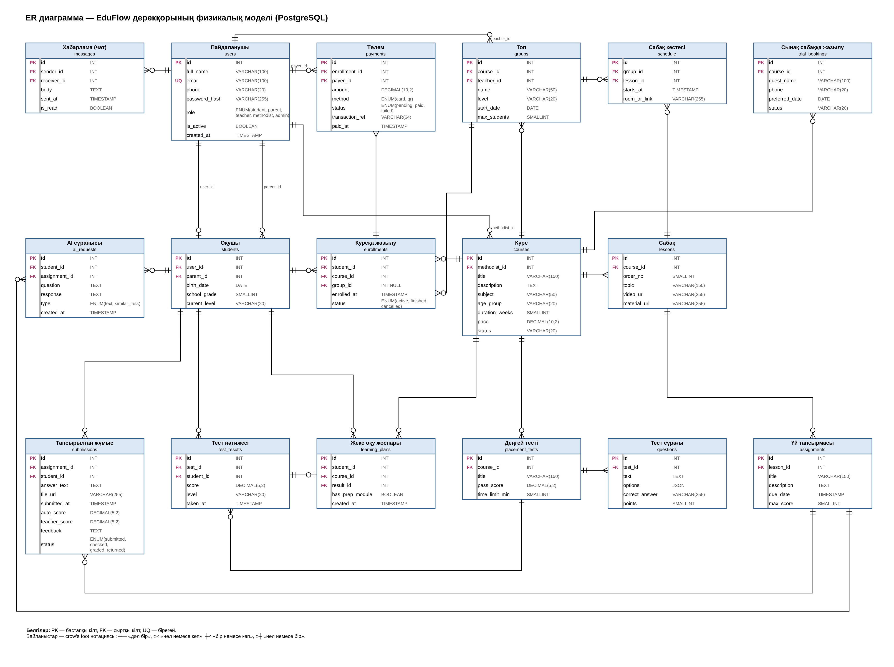

PostgreSQL-ге арналған физикалық модель: **17 кесте**, PK/FK кілттері және деректер түрлері көрсетілген.
Негізгі байланыстар:
* `users` 1 — 0..1 `students` (user_id), `users` 1 — * `students` (parent_id: ата-ананың балалары)
* `courses` 1 — * `lessons` / `groups` / `enrollments` / `placement_tests`
* `enrollments` 1 — * `payments` (бір жазылуға бірнеше төлем әрекеті болуы мүмкін)
* `placement_tests` 1 — * `questions`, 1 — * `test_results`; `test_results` 1 — 0..1 `learning_plans`
* `lessons` 1 — * `assignments` 1 — * `submissions`; `assignments` 1 — * `ai_requests`

Модель **3НФ** талаптарына сай. Әр кестеде қайталанатын топтар жоқ (1НФ). Барлық атрибуттар толық кілтке тәуелді (2НФ). Транзитивті тәуелділіктер жоқ (3НФ).
Мысалы, курс бағасы тек `courses` кестесінде сақталады, ал `payments` оған FK арқылы сілтейді.

---

## 6. Class диаграмма — `12_Class`
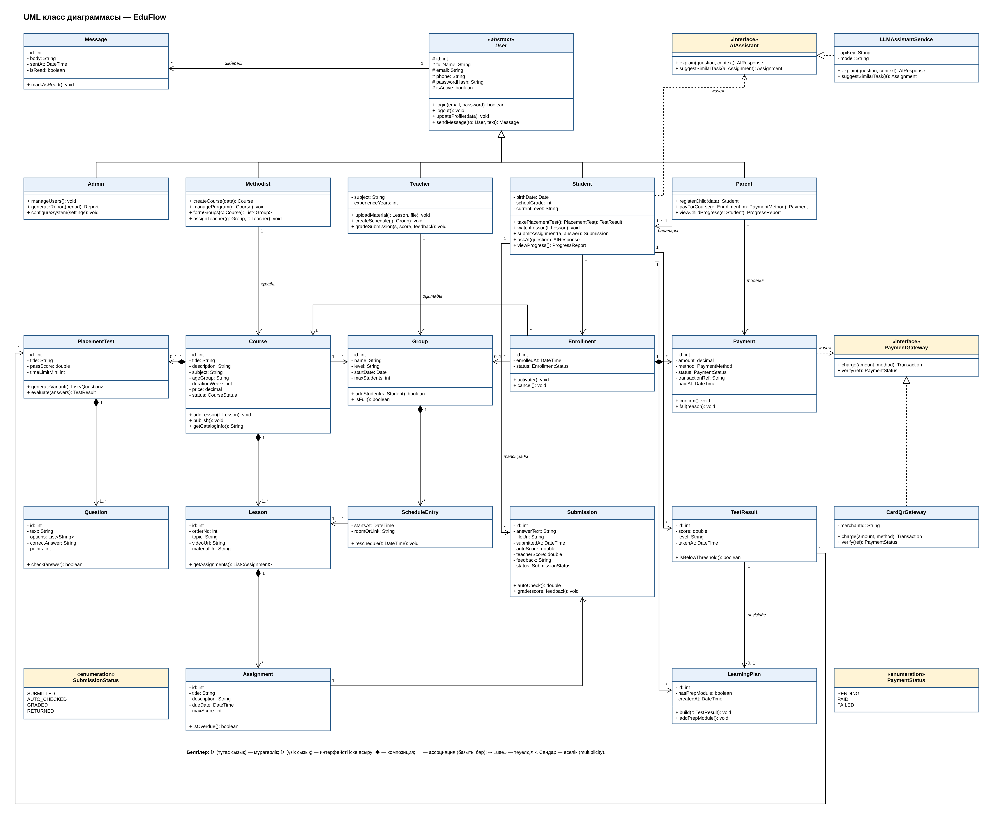

* `User` — **абстрактілі** класс. Одан `Student`, `Parent`, `Teacher`, `Methodist`, `Admin` мұраланады (генерализация).
* **Композиция (◆):** `Course` ◆ `Lesson`, `Lesson` ◆ `Assignment`, `PlacementTest` ◆ `Question`, `Group` ◆ `ScheduleEntry`, `Enrollment` ◆ `Payment`. Бөлік бүтінсіз өмір сүрмейді.
* **Интерфейстер:** `AIAssistant` (іске асыруы — `LLMAssistantService`) және `PaymentGateway` (іске асыруы — `CardQrGateway`).
  Сыртқы сервис ауысса, тек іске асыру класы өзгереді, ал бизнес-логикаға тиіспейміз (Dependency Inversion қағидасы).
* `SubmissionStatus` және `PaymentStatus` — **enumeration**. Олар State диаграммасындағы күйлерге сәйкес келеді.

---

## 7. Sequence диаграммалар
| Файл | Сценарий |
|---|---|
| `13_Sequence_payment` | **Курсқа ақы төлеу.** Ата-ана → қосымша → API → дерекқор → төлем жүйесі. **alt** фрагменті екі жағдайды көрсетеді: төлем сәтті өтсе, жазылу белсендіріледі және түбіртек жіберіледі. Қате болса, ата-анаға хабарланады. |
| `14_Sequence_homework_AI` | **Үй тапсырмасы және AI-көмекші.** **opt** фрагменті: оқушы қаласа, AI сервисінен түсіндірме алады. Содан кейін жұмыс тапсырылады, автотексеріледі, мұғалімге хабарлама барады. Мұғалім бағалаған соң оқушы нәтижені көреді. |

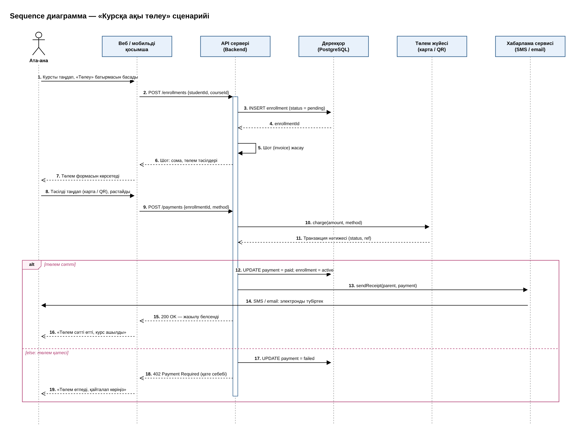
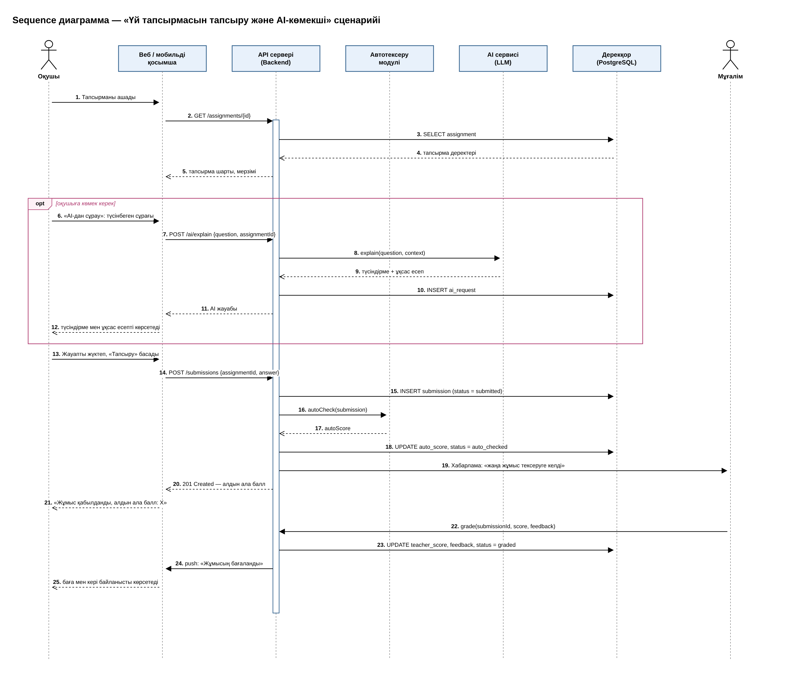

---

## 8. Activity диаграмма — `15_Activity`
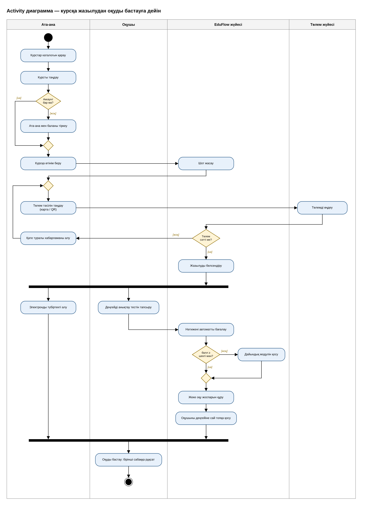

«Курсқа жазылудан оқуды бастауға дейін» процесі **4 жолақта** (swimlane) көрсетілген: Ата-ана, Оқушы, EduFlow жүйесі, Төлем жүйесі.
Мұнда шешім түйіндері (аккаунт бар ма? төлем сәтті ме? балл шекті мәннен жоғары ма?) және төлемді қайталау циклі бар.
**Fork/Join** сызықтары параллель әрекеттерді көрсетеді: ата-ана түбіртек алып жатқанда, оқушы деңгей тестін тапсырады.

---

## 9. State диаграмма — `16_State`
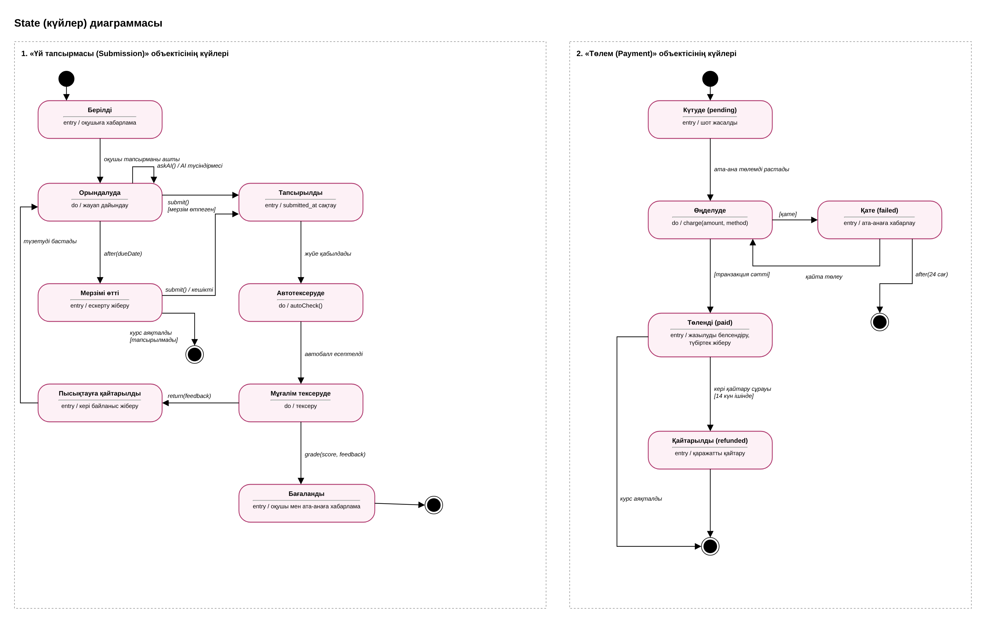

1. **Үй тапсырмасы (Submission):** Берілді → Орындалуда → Тапсырылды → Автотексеруде → Мұғалім тексеруде → Бағаланды.
   Қосымша өтулер: *Мерзімі өтті* (`after(dueDate)`), *Пысықтауға қайтарылды* → Орындалуда, ішкі өту `askAI()`.
2. **Төлем (Payment):** Күтуде → Өңделуде → Төленді / Қате (қайта төлеу) → Қайтарылды (14 күн ішінде).

---

## 10. Component диаграмма — `17_Component`
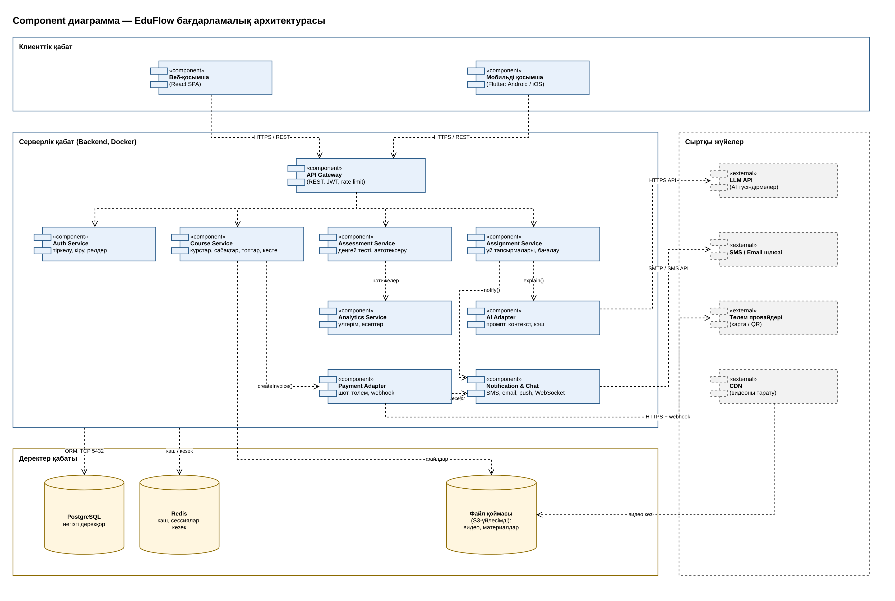

Архитектура 4 қабаттан тұрады:
* **Клиенттік:** React веб-қосымша, Flutter мобильді қосымша.
* **Серверлік:** API Gateway, Auth, Course, Assessment, Assignment, Analytics, AI Adapter, Payment Adapter, Notification & Chat.
* **Деректер:** PostgreSQL, Redis, S3-үйлесімді файл қоймасы.
* **Сыртқы:** LLM API, SMS/Email шлюзі, төлем провайдері, CDN.

---

## 11. Deployment диаграмма — `18_Deployment`
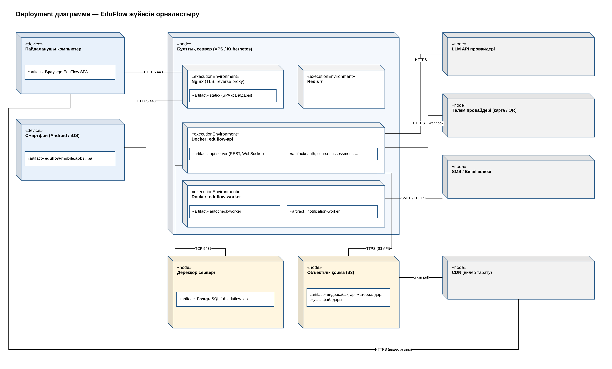

Пайдаланушы құрылғылары (компьютер, смартфон) бұлттық серверге **HTTPS 443** арқылы қосылады.
Серверде Nginx, `eduflow-api` және `eduflow-worker` Docker контейнерлері, Redis жұмыс істейді.
Жеке түйіндерде дерекқор сервері (**TCP 5432**) мен объектілік қойма тұрады. Сыртқы провайдерлер HTTPS арқылы, ал төлем провайдері webhook арқылы қосылады.

---

## Қорғауға дайындық: жиі қойылатын сұрақтар

| Сұрақ | Қысқа жауап |
|---|---|
| IDEF0 мен DFD айырмашылығы неде? | IDEF0 — **функциялар** және оларды басқару/орындау құралдары (ICOM). DFD — **деректердің** қозғалысы: процестер, қоймалар, сыртқы мәндер. DFD-де басқару мен механизм жоқ. |
| IDEF0 мен IDEF3 айырмашылығы? | IDEF0 «не істеледі» деген сұраққа жауап береді, уақыт ретін көрсетпейді. IDEF3 «қандай ретпен» және «қандай шартпен» деген сұраққа жауап береді (XOR, AND қиылыстары). |
| Неге A0-де 5 блок? | IDEF0 ережесі бойынша бір диаграммада 3–6 функция болуы керек. |
| Басқару (C) мен кірістің (I) айырмашылығы? | Кіріс түрленеді (өтінім → профиль). Басқару түрленбейді, ол тек реттейді (бағалау критерийлері, заң). |
| include мен extend айырмашылығы? | include — **әрдайым** орындалады, бағыттауыш негізгі прецеденттен қосылатынға қарай. extend — **шартпен** орындалады, бағыттауыш кеңейтушіден негізгіге қарай. |
| Неге «Тіркелген пайдаланушы» абстрактілі? | Ол өз бетінше жоқ, тек ортақ мүмкіндікті (жүйеге кіру) жинайды. Нақты рөлдер одан мұраланады. |
| Композиция мен агрегацияның айырмашылығы? | Композицияда бөлік бүтінсіз жоқ: курс өшірілсе, сабақтары да өшеді. Агрегацияда бөлік тәуелсіз өмір сүреді. |
| DFD балансы деген не? | Жоғарғы деңгейдегі әр ағын төменгі деңгейде де болуы керек. Біздің контекстік диаграмма мен 1-деңгей сәйкес келеді. |
